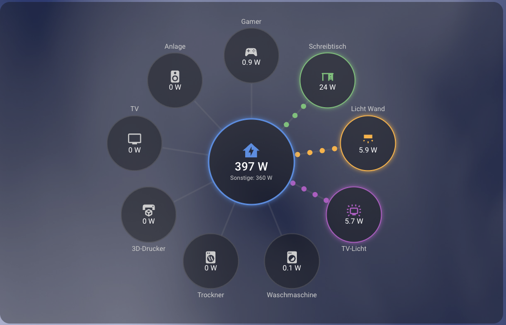

# House Flow Card

**Deutsch:** Lovelace-Karte für Home Assistant im Stil der Energie-Flussansicht: nur das Haus in der Mitte und beliebig viele Verbraucher (z. B. Steckdosen mit Leistungsmessung) rundherum. Ohne Netz, Solar und Batterie.

**English:** Lovelace card for Home Assistant in the style of the energy flow view: just the house in the center and any number of consumers (e.g. smart plugs with power monitoring) around it. No grid, solar or battery.

Inspiriert von der Energie-Fluss-Ansicht von Home Assistant und der [Power Flow Card Plus](https://github.com/flixlix/power-flow-card-plus).

Die Karte ist rein darstellend und löst keine Aktionen aus (Tippen öffnet nur den „Mehr Infos"-Dialog).



## Funktionen

- Haus als großer Kreis in der Mitte mit Icon, Gesamtleistung und Zeile „Sonstige" (Hausleistung minus Summe aller Verbraucher, nie negativ)
- Verbraucher gleichmäßig auf einer Ellipse um das Haus, der erste oben, weitere im Uhrzeigersinn
- Aktive Verbraucher leuchten in ihrer Farbe, auf der Linie laufen animierte Punkte vom Haus zum Verbraucher. Je höher die Leistung, desto schneller die Animation
- Inaktive Verbraucher sind grau, nicht erreichbare Sensoren ausgegraut mit „–" und zählen nicht in „Sonstige"
- Farbpalette mit 12 Standardfarben, pro Verbraucher überschreibbar
- Skaliert mit der Kartenbreite, nutzt die Theme-Variablen von Home Assistant (Hell- und Dunkelmodus)
- Anzeige in W oder kW, Sensoren in W, kW oder MW werden umgerechnet
- Tippen auf einen Kreis öffnet den „Mehr Infos"-Dialog der Entität
- Reines JavaScript, keine Abhängigkeiten, kein Build-Schritt

Gut lesbar bis etwa **12 Verbraucher**. Darüber werden die Kreise sehr klein.

## Screenshots

<!-- Platzhalter: Screenshots bitte nach docs/ legen und hier einbinden, z. B.  -->

_Noch keine Screenshots vorhanden._

## Installation

### HACS

1. HACS öffnen, Menü (drei Punkte) → **Benutzerdefinierte Repositories**
2. Repository-URL eintragen, Kategorie **Dashboard** wählen, hinzufügen
3. „House Flow Card" installieren und die Seite hart neu laden

### Manuell

1. `house-flow-card.js` nach `/config/www/` kopieren
2. Unter Einstellungen → Dashboards → Ressourcen (Erweiterter Modus) eine Ressource hinzufügen: URL `/local/house-flow-card.js`, Typ **JavaScript-Modul**
3. Seite hart neu laden

## Beispiel

```yaml
type: custom:house-flow-card
title: Stromverbrauch
home:
  entity: sensor.haus_leistung
  name: Haus
devices:
  - entity: sensor.waschmaschine_leistung
    name: Waschmaschine
    icon: mdi:washing-machine
  - entity: sensor.trockner_leistung
    name: Trockner
    icon: mdi:tumble-dryer
    color: "#ffb74d"
  - entity: sensor.buero_leistung
    name: Büro
    icon: mdi:desktop-tower-monitor
```

## Optionen

| Option | Standard | Bedeutung |
| --- | --- | --- |
| `home.entity` | Pflicht | Sensor mit der Gesamtleistung des Hauses |
| `home.name`, `home.icon`, `home.color` | Entitätsname, `mdi:home-lightning-bolt`, `#5c9ce6` | Darstellung des Hauses (der Name erscheint als Tooltip) |
| `devices` | Pflicht | Liste der Verbraucher |
| `devices[].entity` | Pflicht | Leistungssensor |
| `devices[].name`, `.icon`, `.color` | Entitätsname, `mdi:flash`, Palette | Darstellung des Verbrauchers |
| `title` | keiner | Titel über der Karte |
| `show_remaining` | `true` | Zeile „Sonstige" unter dem Haus |
| `remaining_name` | `Sonstige` | Beschriftung dieser Zeile |
| `active_threshold` | `1` | Ab dieser Leistung (W) gilt ein Verbraucher als aktiv |
| `watt_threshold` | `1000` | Ab dieser Leistung (W) Anzeige in kW |
| `max_expected_power` | `600` | Leistung (W), bei der die Animation am schnellsten ist |
| `min_flow_rate` / `max_flow_rate` | `0.75` / `6` | Sekunden pro Animationsdurchlauf (schnell / langsam) |
| `max_width` | `600` | Maximale Breite der Grafik in Pixeln |
| `aspect_ratio` | `1` | Verhältnis Breite zu Höhe der Grafik |

## Fehlerbehebung

**Fehler „Custom element doesn't exist: house-flow-card"**: Die Datei wurde nicht als Ressource geladen.

- Ressource prüfen (URL `/local/house-flow-card.js`, Typ „JavaScript-Modul"). Die Karte muss als echte Datei geladen werden, nicht als Inline-Code.
- Seite hart neu laden (Strg+Shift+R).
- In der Companion-App den Frontend-Cache zurücksetzen (Einstellungen → Companion-App → Fehlerbehebung).

## Entwicklung

```sh
npm run check   # Syntaxprüfung
npm test        # Smoke-Test ohne Browser
```

## Lizenz

MIT, siehe [LICENSE](LICENSE).
